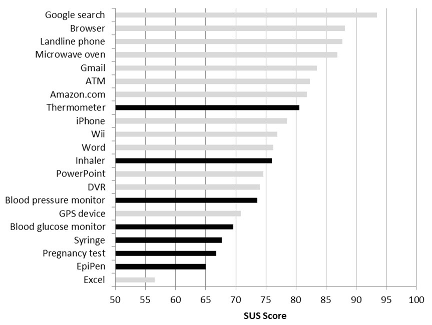
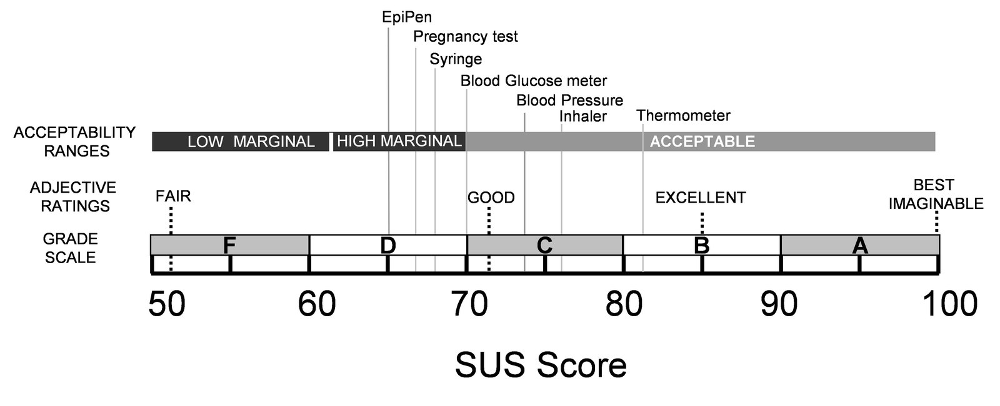

# What a Questionnaire From 1986 Knows About AI Adoption

*A reflection on the System Usability Scale, the quiet labor of using AI, and why the oldest instrument in usability research measures what our newest technology struggles with. With an interactive notebook.*

> Pull quote: "Benchmarks describe the artifact. Usability describes the relationship. Adoption lives in the relationship."

---

## The number we don't collect

Watch how an AI product team talks about itself and you will learn what it believes matters. Benchmark results arrive with decimal places and confidence intervals. Usability, when it comes up at all, arrives as anecdote: a demo that went well, a customer who said something kind. I do not think this is because teams fail to care about users. I think it is because we measure what we own. The model is ours; we trained it, we can score it, and the score improves when we work. The relationship between the product and the person using it belongs to no single team, so it becomes everyone's concern and nobody's metric.

There is an instrument for that relationship, and it is older than the web. The System Usability Scale was created by John Brooke in 1986 at Digital Equipment Corporation and published a decade later under a title that undersold it: SUS, a "quick and dirty" usability scale. Ten statements, rated from strongly disagree to strongly agree. A short piece of arithmetic folds the answers into a score from 0 to 100. A respondent needs three minutes.

*(The rendered post shows an original card of the ten SUS statements here, with the negatively worded items highlighted, attributed to Brooke, 1996.)*

## An instrument for relationships, not artifacts

Every system we ship becomes, on arrival, a sociotechnical system: the artifact, plus the person, plus the practices that grow between them. Most of our measurements see only the artifact. What strikes me about SUS, reading it four decades later, is that its questions never mention technology at all. There are no windows in it, no screens, no clicks, nothing that could go obsolete. It asks about complexity, confidence, learnability, integration, the felt sense of needing help. These are properties of the relationship, not of the machine, which is why the same ten questions that once scored green-screen terminals can score an AI assistant without a word of revision.

That neutrality explains its survival better than any statistical property, though the statistics hold up too. Instruments endure when they are cheap enough to run every release and stable enough to compare across years. SUS is both, and so it quietly became a common language: the same scale has been applied to software, websites, medical devices, scientific equipment, and healthcare systems.

## When usability is load-bearing

The medical and scientific studies are the ones I find myself thinking about most. When Kortum and Peres assessed home health care devices through remote usability testing ([JMIR Human Factors, 2015](https://humanfactors.jmir.org/2015/1/e10/)), the question underneath the study was not whether patients would find the devices pleasant. It was whether the technology could be trusted to work in ordinary hands, away from the people who built it. In clinical and laboratory settings, usability shapes workflow efficiency, error rates, reproducibility, and user confidence.

*Home health care devices (black) and everyday products (gray) on the same SUS scale. Figure 2 from [Kortum & Peres (2015), JMIR Human Factors](https://humanfactors.jmir.org/2015/1/e10/), reproduced under the [Creative Commons Attribution license (CC BY 2.0)](https://creativecommons.org/licenses/by/2.0/).*

Sit with that chart, and hold it loosely. An EpiPen, a device a person must operate correctly during anaphylaxis, scores lower on usability than a microwave oven. But the chart is a snapshot of relationships, taken at particular moments with particular people. The gray bars summarize ratings from more than a thousand users in a companion study published in 2013; the black bars come from 271 Rice University undergraduates who rated 455 devices in their own homes, with no experimenter present, published in 2015. Google search tops the chart in the low nineties as measured then, before results pages thickened with ads and, more recently, AI-generated answers arriving above the results themselves. Would it score the same today? I genuinely do not know, and the not-knowing is instructive: products drift, relationships drift with them, and a forty-year-old instrument sits there, ready to ask again.

The details reward wondering. The thermometer earned the highest score of any medical device in the study, 80.5 across 227 ratings, and I cannot say whether that is a triumph of design or a century of cultural familiarity: its job fits in a sentence, and every rater grew up with one. The iPhone reads in the high seventies on the chart, below the microwave oven, which complicates any easy equation between usability and popularity; whatever moves a billion people to carry a product in their pockets, these ten questions alone do not capture it. And the EpiPen sits last among the devices at 65.3, on just 11 ratings, a sample small enough to be cautious with. Is that a design failure? Is it what any score must look like for a device used rarely, under panic, on training rather than practice? Or does it partly reflect who was asked, healthy undergraduates rather than the patients whose lives depend on it? A SUS score is always a measurement of someone's relationship with a system, and the someone, like the when, is part of the result.

Reproducibility is the item on the stakes list I keep returning to: a system that people use inconsistently produces results that do not replicate, no matter how sound the underlying instrument is. Usability, in other words, is part of the machinery that keeps knowledge reliable. It is not a coat of paint on top of the science; it is load-bearing. I find it hard to read that sentence and not think about AI systems, where the "ordinary hands" now belong to all of us, and where the outputs feed decisions, analyses, and published work.

## The quiet labor of using AI

Traditional software ran a short loop: user action, system response. The contract was legible, and when the system broke it, the failure was visible. AI products stretch the loop into something longer and less certain: user intention, AI interpretation, probabilistic output, human evaluation. That last step deserves more attention than it gets, because it is new work, and we have transferred it to users mostly without saying so.

*(The rendered post includes an original diagram here contrasting the two interaction loops, with the human evaluation step highlighted as "the new, quiet work.")*

To use an AI system well, a person must continually make judgments the software never used to demand of them:

- whether an output is **correct**, or merely fluent;
- how **confident** the system is, and how much of that confidence to inherit;
- when a result can be **trusted** without checking;
- whether the reasoning behind it can be **inspected** at all;
- and how quickly a mistake can be **noticed and undone**.

Trust, in the human sense, is permission to stop verifying. Every AI product implicitly asks its users for that permission, and most give them very little evidence on which to grant it.

This is why I keep returning to a simple framing: technical capability alone does not create adoption. People adopt systems they understand, trust, and can confidently accomplish their goals with. A model can lead every leaderboard and still fail each of those human tests. The gap between capability and adoption is a usability gap, and it runs through AI assistants, developer tools, scientific computing workflows, enterprise AI platforms, and data science tools alike.

The notebook below lets you try these ideas directly. First, take the SUS about a product you actually use: answer the ten questions, and watch the score, its grade, and a per-question breakdown of where you are losing points update as you go. Then open the simulator. It builds two AI products on the same underlying model, one powerful but hard to trust, the other candid about its limits and built around the workflow, and gives you three sliders that separate them: trust communication, learnability, and complexity. Raise only the trust slider, leave the other two where they are, and see how far the score moves. That one lever, being honest about what the system can and cannot do, costs less than almost anything on a product roadmap, and ships far less often than it should.

## What one number can hold

The average SUS score across many hundreds of product studies is about 68, and interpretation follows a curve rather than a percentage: 68 is average, 80 is genuinely good, and above 90 is rare. Kortum and Peres plotted their devices on exactly this interpretive scale, three vocabularies layered over one number:

*The same devices on the interpretive scale: acceptability ranges, adjective ratings, and grades layered over one number. Figure 3 from [Kortum & Peres (2015), JMIR Human Factors](https://humanfactors.jmir.org/2015/1/e10/), also [CC BY 2.0](https://creativecommons.org/licenses/by/2.0/). The notebook below puts an interactive version of this scale under your own score.*

A single score is a compression, and compressions are honest only if we remember what they discard. SUS will not tell you which design decision to change, and it will not tell you whether your model is good. What it holds is something benchmarks cannot: whether people understand the system, trust the workflow, and can achieve what they came to do. Capability and usability are separate measurements, and a product needs both to be adopted: one that is only capable is a demonstration, and one that is only usable is a pleasant tool nobody needs.

## Translation is the work

Carrying a technical product toward its users means working between two vocabularies, measured by different instruments and often owned by different teams: what the product enables, and why anyone would adopt it. Usability research is the evidence that lets the two check each other, and SUS is the version cheap enough to gather every release and steady enough to settle a roadmap argument.

My experience conducting usability testing at Minitab and later conducting usability testing with internal and external users for Posit's IDE Jupyter notebook frontend reinforced that products succeed when teams understand user workflows, not just feature requirements. Sitting beside someone as they use the thing you helped build is a humbling form of measurement, and the humility is the data.

Great technology creates possibilities. Great usability turns those possibilities into adoption.

If you run a SUS study on an AI product, I would like to hear what you found, especially where the number disagreed with your team's intuition. Those disagreements are usually where the relationship is trying to tell you something. [Write to me](mailto:rodrigosf672@gmail.com?subject=SUS%20on%20an%20AI%20product).

### References & further reading

- Brooke, J. (1996). SUS: A "Quick and Dirty" Usability Scale. In *Usability Evaluation in Industry*. Taylor & Francis. The original instrument.
- Kortum, P., & Peres, S. C. (2015). Evaluation of Home Health Care Devices: Remote Usability Assessment. *JMIR Human Factors*, 2(1), e10. [humanfactors.jmir.org/2015/1/e10](https://humanfactors.jmir.org/2015/1/e10/). Source of the two figures (CC BY 2.0); the black bars.
- Kortum, P. T., & Bangor, A. (2013). Usability Ratings for Everyday Products Measured With the System Usability Scale. *International Journal of Human-Computer Interaction*, 29(2), 67–76. The companion study behind the gray bars.
- Sauro, J. (2011). *A Practical Guide to the System Usability Scale*. Measuring Usability LLC. Source of the curved grade interpretation used here.
- [UXtweak, The System Usability Scale (SUS): guide](https://blog.uxtweak.com/system-usability-scale/). A practitioner walkthrough of the scoring mechanics.

---

*Rodrigo Silva Ferreira builds open source tools, studies how developers adopt AI, and translates technical innovation into products developers trust and love to use. He speaks regularly at Python and data science conferences; past talks, upcoming talks, and recordings live on [his talks page](https://rodrigosf.com/talks.html).*
